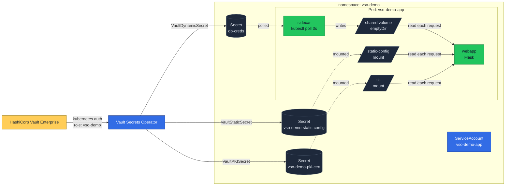
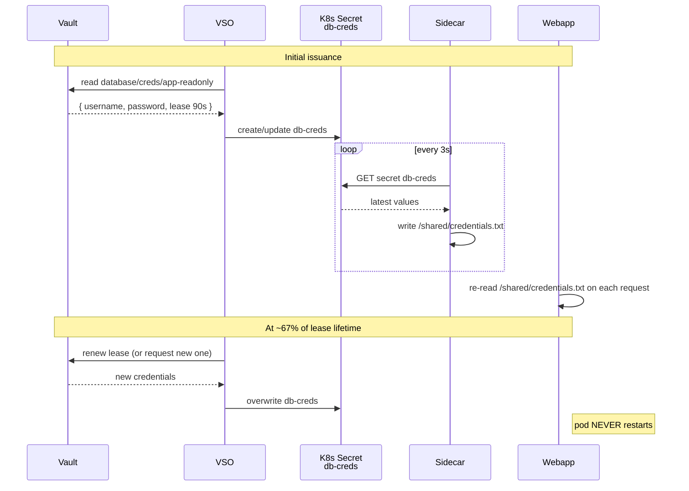
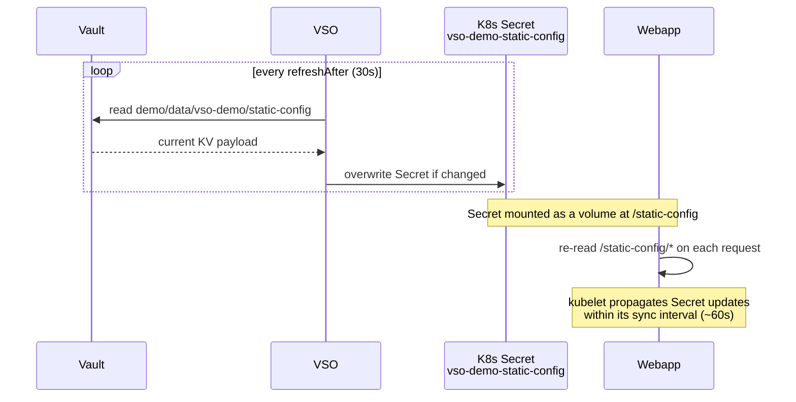
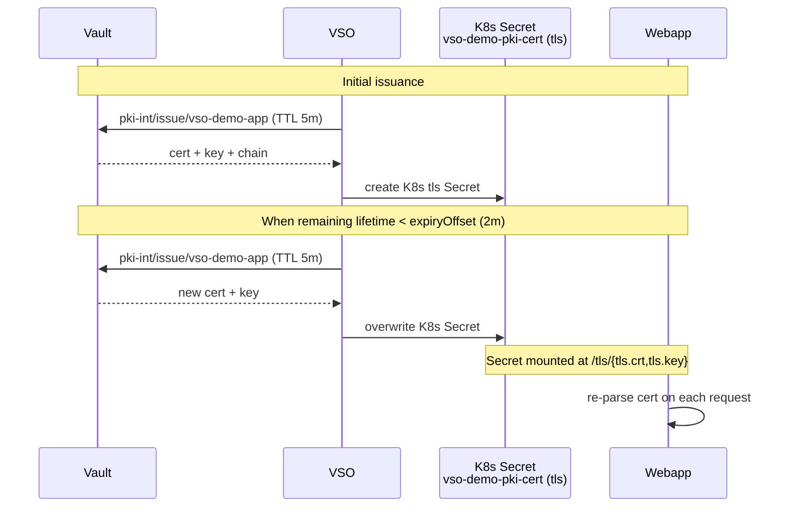

# Architecture

This demo packs three independent secret-rotation patterns into the same pod.
The pod itself never restarts during normal operation; rotation happens through
filesystem updates that the application re-reads on each request.

## Component overview

## The three patterns

### Pattern 1 — Dynamic Secret (Database)

Why the sidecar? Without `rolloutRestartTargets` on the `VaultDynamicSecret`,
the K8s Secret updates in place but the pod has no native way to know. The
sidecar bridges that gap by polling the API and writing to a shared volume.

### Pattern 2 — Static Secret (KV v2)

No sidecar needed — kubelet handles the in-place update of mounted Secrets.

### Pattern 3 — PKI Secret

Same as Pattern 2 from a delivery angle: the cert lives in a K8s Secret that
kubelet keeps in sync with the volume mount. The novelty is the rotation
trigger (`expiryOffset`) and the TLS-typed Secret.

## Why "no restart" matters

Long-lived processes with in-memory connection pools, JIT-compiled caches, or
expensive startup costs benefit a lot from never being recycled by a secret
rotation event. The trade-off:

- Webapp must re-read its inputs from disk often enough (every request is fine
  for low-traffic UIs, periodic refresh threads are needed for high-RPS apps).
- Database drivers must reconnect when credentials rotate. The simplest way is
  to set a short max age on the connection pool (e.g., 60s) so workers naturally
  pick up the new credentials. The sidecar approach assumes this.

For workloads that don't mind a restart, VSO's `rolloutRestartTargets` is
simpler and has lower memory cost (no sidecar).
